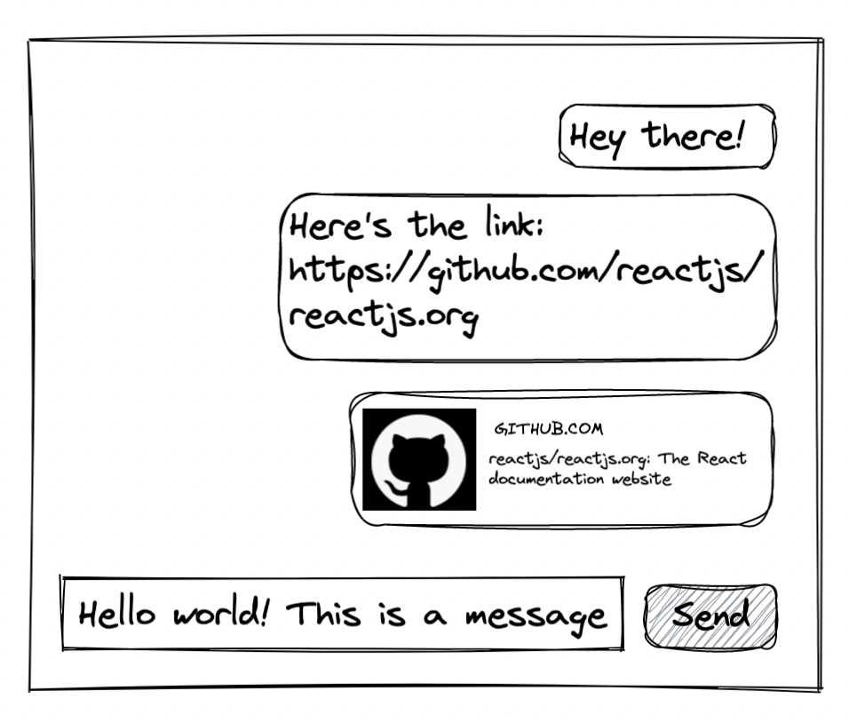

This is a [Next.js](https://nextjs.org/) project bootstrapped with [`create-next-app`](https://github.com/vercel/next.js/tree/canary/packages/create-next-app).

## Getting Started

First, run the development server:

```bash
npm run dev
# or
yarn dev
```

Open [http://localhost:3000](http://localhost:3000) with your browser to see the result.

You can start editing the page by modifying `pages/index.tsx`. The page auto-updates as you edit the file.

[API routes](https://nextjs.org/docs/api-routes/introduction) can be accessed on [http://localhost:3000/api/hello](http://localhost:3000/api/hello). This endpoint can be edited in `pages/api/hello.ts`.

The `pages/api` directory is mapped to `/api/*`. Files in this directory are treated as [API routes](https://nextjs.org/docs/api-routes/introduction) instead of React pages.

## Learn More

To learn more about Next.js, take a look at the following resources:

-   [Next.js Documentation](https://nextjs.org/docs) - learn about Next.js features and API.
-   [Learn Next.js](https://nextjs.org/learn) - an interactive Next.js tutorial.

You can check out [the Next.js GitHub repository](https://github.com/vercel/next.js/) - your feedback and contributions are welcome!

## Deploy on Vercel

The easiest way to deploy your Next.js app is to use the [Vercel Platform](https://vercel.com/new?utm_medium=default-template&filter=next.js&utm_source=create-next-app&utm_campaign=create-next-app-readme) from the creators of Next.js.

Check out our [Next.js deployment documentation](https://nextjs.org/docs/deployment) for more details.

## Objectifs

Your challenge is to create a minimal chat UI:



### Functionalities

-   Authentication is not needed
-   Texts written in input column should appear in message list when then “Send” button is clicked
-   When a message contains a link, the link should be clickable
-   On browser reload, any sent messages should persist

### Requirements

-   Code must be in React and Typescript. Add typing where you think it’s important.

### Bonus

-   Good/clean UI
-   Generate URL preview if a message contains a link
-   Allow deleting a message

**Notes:**

With some experience in React, you will not spend more than 3 hours for this challenge. What we want to see is..

-   Ability to code based on the given mock up
-   Managing state in React
-   Good preference in code styles (ie. code is easy to read, well formatted, clear logic, no type errors)

